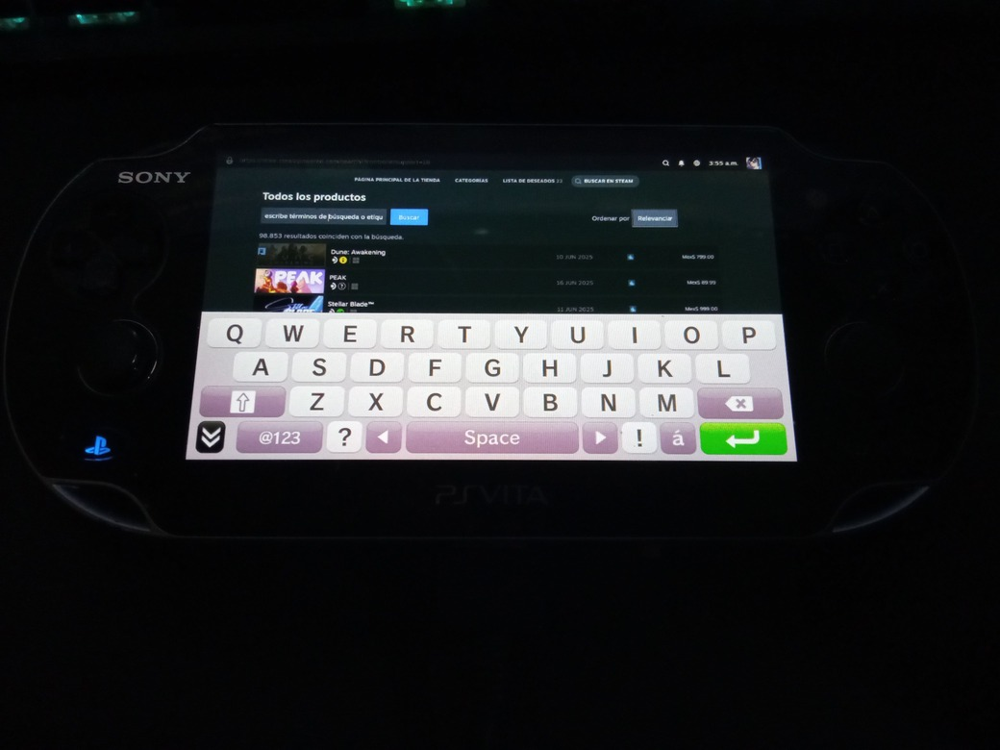
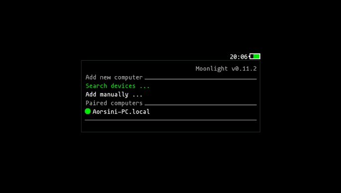
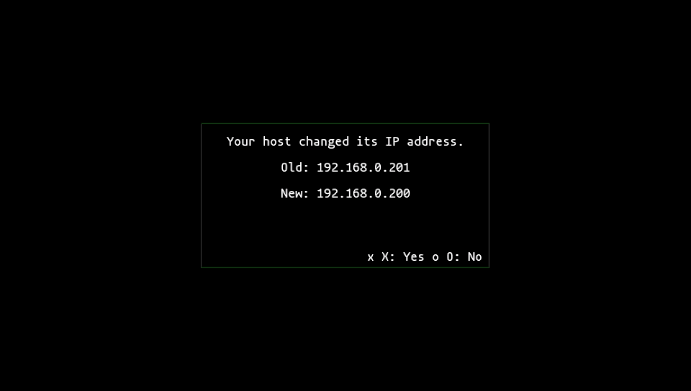

# Vita Moonlight Motion

Vita Moonlight Motion is a PlayStation Vita port of Moonlight, with major improvements for usability, pairing, device management, and now advanced touch and multitouch support.

---

## What's New

- **Multi-touch touchscreen mode:** New tablet-style mode compatible with Sunshine, with true multitouch support and native gestures (e.g. pinch-to-zoom).
- **Improved Absolute Mouse mode:** Cursor always follows the main finger, right click with two-finger tap, natural two-finger scrolling.
- **Exclusive touch mode selection:** Choose between "Touch Mouse Absolute" (mouse gestures) or "Touchscreen (Sunshine multitouch)" (multitouch tablet) in the settings menu.
- **No ghost cursor:** In touchscreen mode, the host cursor is hidden and no mouse clicks are sent.
- **Physical controls always active:** Gamepad controls work in both touch modes.
- **Refined gesture and touch experience:** Improved logic for right click, scrolling, and multitouch gestures.
- **Host status indicator dots:** Green (online), yellow (IP change pending), red (offline/disconnected).
- **Robust host status checking:** Background scan thread and mDNS sniffer.
- **Manual refresh:** Press TRIANGLE (△) in the main menu or device search to refresh host/device status instantly.
- **IP change confirmation dialog:** Always shows old and new IP, and always asks for confirmation.
- **UI and logic robust to missing/empty host fields.**
- **Improved debug logging and error handling.**
- **Automatic pairing fixed:** The pairing process is now more reliable and user-friendly. You can now pair your PC directly from the Vita using "Search device"—no more manual pairing required!
- **Elevated floating keyboard:** The virtual keyboard now appears above the app, never covering the main screen (see screenshot below).
- **Updated libraries:** All dependencies and core libraries (moonlight-common-c, enet, inih) have been updated for better compatibility and stability.
- **New modular mDNS sniffer:** Fast and reliable device discovery on your local network.
- **Many bugfixes and code cleanups.**

---

## Screenshots

<p align="center">
  
  <br><b>Floating keyboard in a Steam app using Moonlight</b>
</p>

<p align="center">
  
  <br><b>Host waiting for IP update (yellow)</b>
</p>

<p align="center">
  
  <br><b>Host online (green)</b>
</p>

<p align="center">
  
  <br><b>Host offline/disconnected (red)</b>
</p>

<p align="center">
  
  <br><b>IP change confirmation dialog (shows old/new IP)</b>
</p>

<p align="center">
  
  <br><b>Search device function showing a found local device</b>
</p>

---

## Credits

- Current improvements and maintenance: **AorsiniYT**
- Based on the work of:
  - [MetalfaceScout/vita-moonlight-motion](https://github.com/MetalfaceScout/vita-moonlight-motion)
  - [xyzz/vita-moonlight](https://github.com/xyzz/vita-moonlight)
  - [moonlight-stream/moonlight-common-c](https://github.com/moonlight-stream/moonlight-common-c)

---

## Build Requirements

- **VitaSDK** installed and configured on your system ([guide here](https://vitasdk.org/)).
- **Submodules updated:**
  ```sh
  git submodule update --init
  ```

---

## Quick Build

1. Install dependencies with [vdpm](https://github.com/vitasdk/vdpm) if you haven't already.
2. Make sure VitaSDK is installed and in your $PATH.
3. Run:
   ```sh
   ./makepsv
   ```
   This will generate a VPK file ready to install on your PS Vita.

---

## Manual Build (optional)

If you prefer to build manually:

```sh
# If you do git pull, make sure to update submodules first
 git submodule update --init
 mkdir build && cd build
 cmake ..
 make
```

---

## Note about colors in vita2d

> **Important:** The vita2d library interprets colors in BGRA format (not RGBA). For example:
> - 0xFF00FFFF will appear **yellow** (not cyan)
> - 0xFFFFFF00 will appear **blue** (not yellow)
> - 0xFF00FF00 will appear **green** (correct)
> - 0xFFFF0000 will appear **red** (correct)
>
> If the color does not look as expected, swap the byte order (use BGR instead of RGB).

---

Thanks to all contributors and the Moonlight community!
